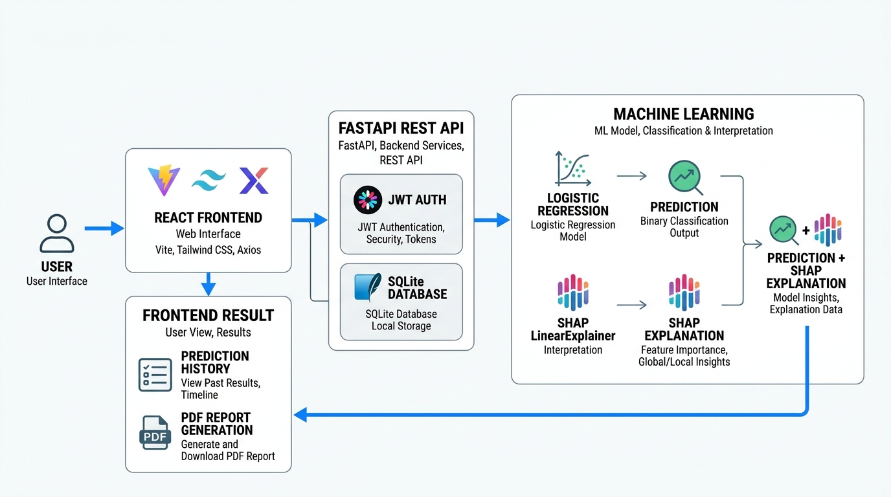

# 🫀 CardioSense AI

### AI-Powered Heart Disease Prediction Platform

CardioSense AI is a full-stack ML healthcare application with React, FastAPI, authentication, SQLite, explainable AI, geolocation-based healthcare search, Docker containerization, and automated CI.

---


# 🏗️ System Architecture




## 🚀 Features

- 🫀 AI-based Heart Disease Prediction
- 🔐 Secure User Authentication (JWT)
- 👨‍⚕️ Patient Management (CRUD)
- 📊 Interactive Analytics Dashboard
- 📜 Prediction History
- 📈 Explainable AI with SHAP
- 🏥 Nearby Cardiologist & Hospital Finder
- 🌍 Location-based Healthcare Search
- 🌙 Dark Mode Support
- 📱 Fully Responsive Design
- ⚡ FastAPI REST API
- 🎨 Modern UI built with Tailwind CSS

---

## 🛠️ Technology Stack

### Frontend

- React
- Vite
- Tailwind CSS
- React Router
- Axios

### Backend

- FastAPI
- SQLAlchemy
- Pydantic
- JWT Authentication
- SQLite

### Machine Learning

- Python
- Scikit-learn
- Pandas
- NumPy
- SHAP
- Pickle

### Location & Maps

- Leaflet
- React-Leaflet
- OpenStreetMap
- Nominatim
- Overpass API

### DevOps

- Docker
- Docker Compose
- Nginx
- GitHub Actions (CI)

---

# 📸 Application Preview

## 🏠 Home Page


---

## ❤️ Heart Disease Prediction


---

## 📊 Analytics Dashboard


---

## 🔐 Authentication


---

# 📂 Project Structure

```text
Heart-Disease-Prediction-System-with-Machine-Learning
│
├── .github
│   └── workflows
│       └── ci.yml
│
├── frontend
│   ├── src
│   │   ├── components
│   │   │   └── NearbyCare
│   │   │       ├── MapViewer.jsx
│   │   │       └── FacilityList.jsx
│   │   │
│   │   ├── hooks
│   │   │   └── useNearbyFacilities.js
│   │   │
│   │   ├── pages
│   │   │   └── NearbyCarePage.jsx
│   │   │
│   │   └── services
│   │       └── api.js
│   │
│   ├── backend
│   │   ├── app
│   │   │   ├── routers
│   │   │   │   ├── auth_router.py
│   │   │   │   ├── prediction_router.py
│   │   │   │   └── nearby_router.py
│   │   │   │
│   │   │   ├── auth.py
│   │   │   ├── database.py
│   │   │   ├── predictor.py
│   │   │   └── schemas.py
│   │   │
│   │   ├── requirements.txt
│   │   └── main.py
│   │
│   ├── package.json
│   └── vite.config.js
│
├── models
│   └── model.sav
│
├── images
│
├── Dockerfile.backend
├── Dockerfile.frontend
├── docker-compose.yml
├── nginx.conf
├── .dockerignore
├── README.md
└── LICENSE
```
docker compose up -d
http://localhost:3000
---

# ⚙️ Installation

## Clone the Repository

```bash
git clone https://github.com/YOUR_GITHUB_USERNAME/Heart-Disease-Prediction-System-with-Machine-Learning.git

cd Heart-Disease-Prediction-System-with-Machine-Learning
```

---

## Backend Setup

```bash
cd frontend/backend

python -m venv venv

# Windows
venv\Scripts\activate

pip install -r requirements.txt

uvicorn main:app --reload
```

Backend:

```
http://127.0.0.1:8000
```

Swagger API Documentation:

```
http://127.0.0.1:8000/docs
```

---

## Frontend Setup

```bash
cd frontend

npm install

npm run dev
```

Frontend:

```
http://localhost:3000
```

---

# 🐳 Running with Docker

CardioSense AI can be run using Docker Compose, which starts the frontend and backend as separate containers.

### Start the application

```bash
docker compose up -d
docker compose ps
docker compose logs backend
```


# 🤖 Machine Learning Model

The prediction engine is built using a supervised Machine Learning model trained on clinical heart disease data.

### Input Features

- Age
- Sex
- Chest Pain Type
- Resting Blood Pressure
- Cholesterol
- Fasting Blood Sugar
- Resting ECG
- Maximum Heart Rate
- Exercise-Induced Angina
- Oldpeak
- ST Slope

### Prediction Output

- 🟢 Low Risk
- 🔴 High Risk

---

# 📡 REST API

| Method | Endpoint | Description |
|--------|----------|-------------|
| POST | `/auth/register` | Register User |
| POST | `/auth/login` | User Login |
| GET | `/auth/me` | Current User |
| GET | `/patients` | List Patients |
| POST | `/patients` | Create Patient |
| PUT | `/patients/{id}` | Update Patient |
| DELETE | `/patients/{id}` | Delete Patient |
| POST | `/predict` | Predict Heart Disease |
| GET | `/history` | Prediction History |
| GET | `/nearby/search` | Search for a location |
| GET | `/nearby/facilities` | Find nearby healthcare facilities |

---


---

# 👨‍💻 Author

**Dhrubo Ratul Basak**

M.Sc. Data Science  
TU Dortmund University

> ⚠️ **Disclaimer:** CardioSense AI is an educational and portfolio project. Its predictions are not medical diagnoses and should not be used as a substitute for professional medical advice.

---

# 📄 License

This project is licensed under the MIT License.
