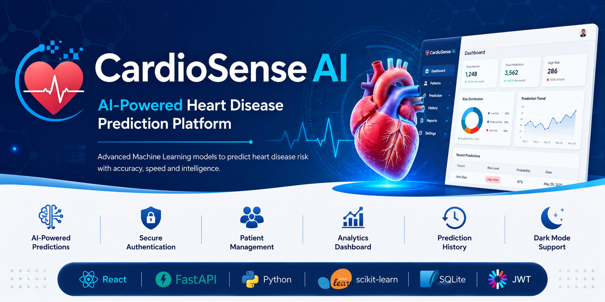
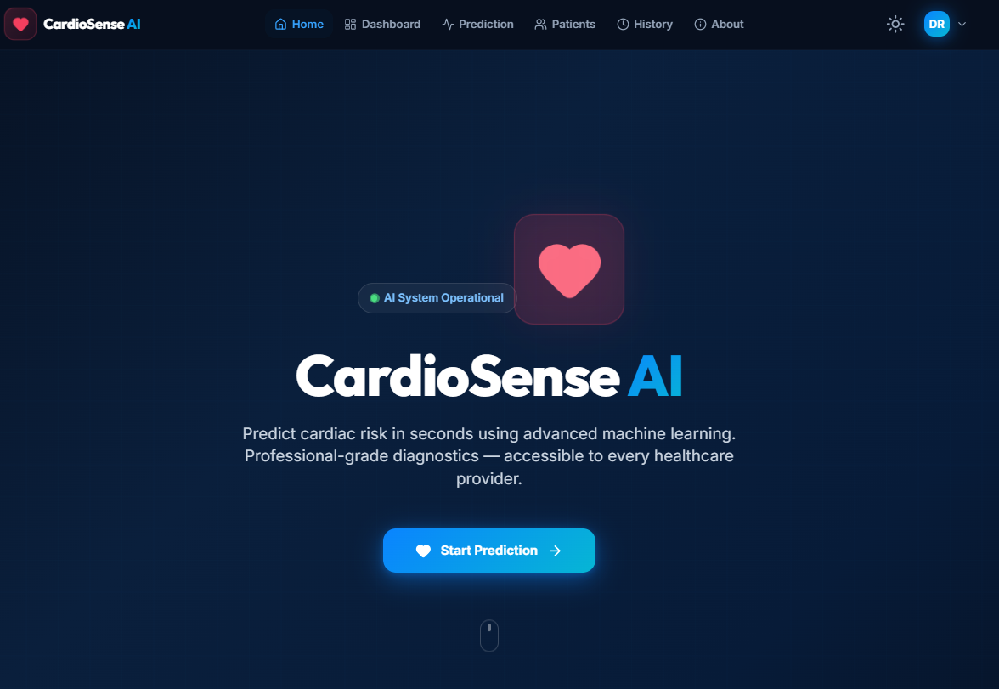
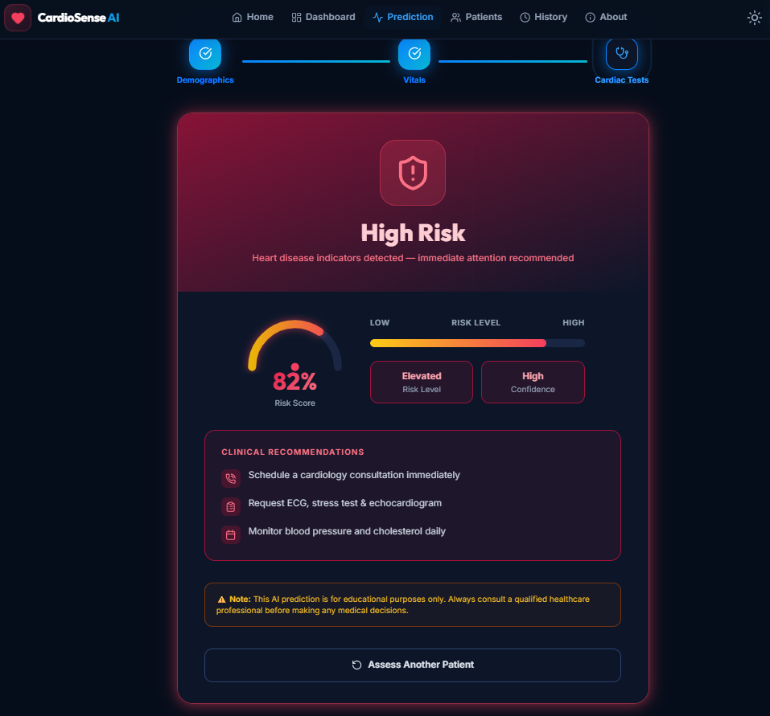
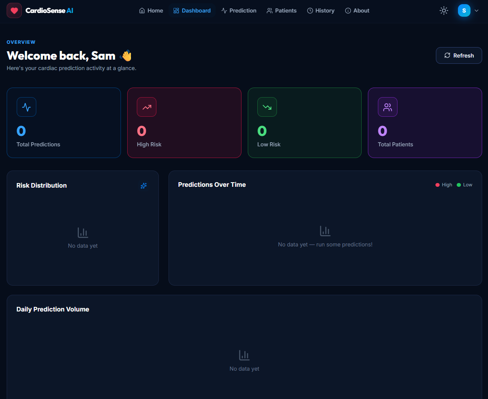
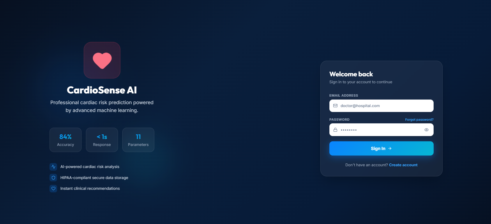

# 🫀 CardioSense AI

### AI-Powered Heart Disease Prediction Platform

CardioSense AI is a modern full-stack healthcare web application that predicts the risk of heart disease using a trained Machine Learning model. The platform enables secure user authentication, patient management, interactive analytics, and real-time predictions through an intuitive and responsive interface.

---

## 🚀 Features

- 🫀 AI-based Heart Disease Prediction
- 🔐 Secure User Authentication (JWT)
- 👨‍⚕️ Patient Management (CRUD)
- 📊 Interactive Analytics Dashboard
- 📜 Prediction History
- 🌙 Dark Mode Support
- 📱 Fully Responsive Design
- ⚡ FastAPI REST API
- 🤖 Machine Learning Integration
- 🎨 Modern UI built with Tailwind CSS

---

## 🛠️ Technology Stack

### Frontend

- React
- Vite
- Tailwind CSS
- React Router
- Axios

### Backend

- FastAPI
- SQLAlchemy
- Pydantic
- JWT Authentication
- SQLite

### Machine Learning

- Python
- Scikit-learn
- Pandas
- NumPy
- Pickle

---

# 📸 Application Preview

## 🏠 Home Page



---

## ❤️ Heart Disease Prediction



---

## 📊 Analytics Dashboard



---

## 🔐 Authentication



---

# 📂 Project Structure

```text
Heart-Disease-Prediction-System-with-Machine-Learning

│
├── frontend
│   ├── src
│   ├── public
│   ├── package.json
│   └── vite.config.js
│
├── backend
│   ├── app
│   │   ├── routers
│   │   ├── auth.py
│   │   ├── database.py
│   │   ├── predictor.py
│   │   └── schemas.py
│   │
│   ├── requirements.txt
│   └── main.py
│
├── models
│   └── model.sav
│
├── images
│
├── README.md
└── .gitignore
```

---

# ⚙️ Installation

## Clone the Repository

```bash
git clone https://github.com/YOUR_GITHUB_USERNAME/Heart-Disease-Prediction-System-with-Machine-Learning.git

cd Heart-Disease-Prediction-System-with-Machine-Learning
```

---

## Backend Setup

```bash
cd frontend/backend

python -m venv venv

# Windows
venv\Scripts\activate

pip install -r requirements.txt

uvicorn main:app --reload
```

Backend:

```
http://127.0.0.1:8000
```

Swagger API Documentation:

```
http://127.0.0.1:8000/docs
```

---

## Frontend Setup

```bash
cd frontend

npm install

npm run dev
```

Frontend:

```
http://localhost:3000
```

---

# 🤖 Machine Learning Model

The prediction engine is built using a supervised Machine Learning model trained on clinical heart disease data.

### Input Features

- Age
- Sex
- Chest Pain Type
- Resting Blood Pressure
- Cholesterol
- Fasting Blood Sugar
- Resting ECG
- Maximum Heart Rate
- Exercise-Induced Angina
- Oldpeak
- ST Slope

### Prediction Output

- 🟢 Low Risk
- 🔴 High Risk

---

# 📡 REST API

| Method | Endpoint | Description |
|---------|----------|-------------|
| POST | `/auth/register` | Register User |
| POST | `/auth/login` | User Login |
| GET | `/auth/me` | Current User |
| GET | `/patients` | List Patients |
| POST | `/patients` | Create Patient |
| PUT | `/patients/{id}` | Update Patient |
| DELETE | `/patients/{id}` | Delete Patient |
| POST | `/predict` | Predict Heart Disease |
| GET | `/history` | Prediction History |

---

# 🎯 Future Improvements

- 🤖 AI Health Assistant
- 📄 PDF Report Generation
- 📈 Explainable AI (SHAP)
- 🏥 Nearby Cardiologist & Hospital Finder
- 📍 Interactive Maps Integration
- ☁️ Cloud Deployment
- 🐳 Docker Support
- 🗄 PostgreSQL Database
- 📧 Email Notifications
- 🔄 CI/CD Pipeline

---

# 👨‍💻 Author

**Dhrubo Ratul Basak**

M.Sc. Data Science  
TU Dortmund University

GitHub:

https://github.com/YOUR_GITHUB_USERNAME

---

# 📄 License

This project is licensed under the MIT License.
